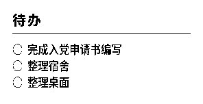

# Dot-CanvasCreate-Tools
适用于拓点 Dot. Quote/0 Canvas API 的实用工具

## 这是什么？
本项目为没有相关开发经验的拓点 Dot. Quote/0 用户提供快速可复用的实用工具编辑器，用户可以自行填入 API 密钥和设备序列号，快速在 Quote/0 上使用一些基本工具。

## 安全声明
本项目使用拓点 Dot. 提供的 API 链接，使用静态网站为用户提供服务，不存在远程获取数据或者保存数据，用户在本项目所提供的网站上生成或填入的所有数据均在本地处理完成。

## 工具列表与演示
> 需要注意：在本项目实际测试得出的 Quote/0 可以显示边线的最大显示范围为 295px × 150px 超过此数值可能导致内容显示不全。

### 待办事项

通过设备传输将待办内容、状态传入Quote/0。    
[开始编辑](./service/edit-today.html)

### 调试工具
- [Display-Area](./dev/display-area.html) 此工具帮助您确认 Quote/0 屏幕安全显示区域，确认四周线全部能看到即可，欢迎提交 issue 。
